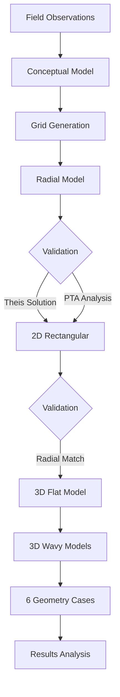

# WaveThesis - Modeling Permeable Aquifers at Basaltic Lava Flow Contact Zones

[](https://www.python.org/downloads/)
[](https://github.com/acroucher/PyTOUGH)

## 📋 Overview

This repository contains the complete numerical modeling workflow and Python scripts developed for my Master's thesis: **"Investigation of Modeling Permeable Aquifers at the Contact Zones of Basaltic Lava Flows"** (M.Sc. in Sustainable Energy Science, Reykjavík University, June 2024).

The research investigates how the **undulating geometry** of permeable zones between basaltic lava flows affects **pressure response during fluid injection scenarios**, using the geothermal reservoir simulator **AUTOUGH2**.

### 🎯 Key Research Question
*How does the geometry of permeable contact zones between basalt flows impact injection pressure and fluid flow behavior in geothermal reservoirs?*

---

## 🔬 Research Highlights

### Core Findings
- **Amplitude Effect**: Larger amplitude undulations (1m vs 0.5m) result in **lower injection pressures**
- **Wave Frequency**: Increased number of waves (wavelength variation) correlates with **reduced pressure response**
- **Volume Impact**: Higher permeable rock volume leads to lower injection pressure, though **geometry remains the primary control**
- **Flow Direction**: Aquifer geometry directly influences **mass flow patterns** and fluid distribution

### Technical Achievements
- Developed complete **Python-based workflow** for geothermal reservoir model generation
- Created **radial, 2D, and 3D rectangular models** with progressive complexity validation
- Implemented **MINC (Multiple Interacting Continua)** fractured rock modeling
- Generated **6 synthetic aquifer geometry cases** with varying amplitudes and wavelengths
- Validated numerical results against **Theis analytical solution** and pressure transient analysis

## 🛠️ Technologies & Tools

### Reservoir Engineering
- **AUTOUGH2 2.2** - Geothermal reservoir numerical simulator
- **PyTOUGH** - Python library for TOUGH2 pre/post-processing
- **TIM (This Isn't Mulgraph)** - GUI for TOUGH2 model manipulation

### Python Stack
- **NumPy** - Numerical computations and array operations
- **Matplotlib** - Data visualization and pressure profile plotting
- **SciPy** - Scientific computing (exponential integrals, interpolation)
- **Pandas** - Data manipulation and CSV handling

### Geoscience Tools
- **Leapfrog Geothermal** - 3D geological conceptual modeling
- **QGIS** - Spatial analysis and geological mapping

## 🚀 Getting Started

### Prerequisites

# Python 3.7 or higher
python --version

# Required Python packages
pip install numpy matplotlib scipy pandas
pip install pytough  # For TOUGH2/AUTOUGH2 integration

## 📊 Thesis Key Model Parameters

### Fixed Reservoir Properties
| Parameter | Value | Unit |
|-----------|-------|------|
| Reservoir Temperature | 10 | °C |
| Reservoir Pressure | 34.798 | bar |
| Reservoir Permeability | 5×10⁻¹³ | m² |
| Porosity | 25 | % |
| Injection Block Thickness | 0.25 | m |
| Injection Mass Flow | 0.5 | kg/s |
| Simulation Time | 10⁷ | seconds (~0.32 years) |

### Aquifer Geometry Cases
| Case | # Waves | Amplitude | Description |
|------|---------|-----------|-------------|
| 0 | 0 | 0 m | Flat reference model |
| 1 | 1 | 0.5 m | Single wave, small amplitude |
| 2 | 1 | 1.0 m | Single wave, large amplitude |
| 3 | 2 | 0.5 m | Two waves, small amplitude |
| 4 | 2 | 1.0 m | Two waves, large amplitude |
| 5 | 3 | 0.5 m | Three waves, small amplitude |
| 6 | 3 | 1.0 m | Three waves, large amplitude |

## 🔍 Workflow Methodology

### 1. Model Validation Hierarchy
```
Radial Model → 2D Rectangular → 3D Flat → 3D Wavy Geometries
     ↓              ↓              ↓              ↓
  Theis       Radial         2D Model      Flat 3D Model
  Solution    Validation     Validation    Validation
```

### 2. Numerical Modeling Process



### 3. Analytical Validation
- **Theis Solution**: Constant rate test analytical model
- **Pressure Transient Analysis**: Bourdet derivative plots
- **MINC Verification**: Fracture-matrix interaction validation

## 🎓 Academic Context

### Thesis Information
- **Title**: Investigation of Modeling Permeable Aquifers at the Contact Zones of Basaltic Lava Flows
- **Author**: Yonathan Hary Hutagalung
- **Degree**: M.Sc. in Sustainable Energy Science
- **Institution**: Reykjavík University, Iceland
- **Supervisor**: Dr. Juliet Ann Newson
- **Examiner**: Prof. Michael O'Sullivan (University of Auckland)
- **Completion**: June 2024

### Study Area
**Reykjanes Peninsula, Iceland**
- Active geothermal region with basaltic geology
- Overlapping lava flows (13-14 million years old)
- Complex permeable zone structures at lava flow contacts

### Research Objectives
1. Develop numerical modeling workflow for undulating aquifer geometries
2. Investigate geometric effects on injection pressure response
3. Validate models against analytical solutions and field observations
4. Create Python tools for reproducible geothermal reservoir analysis
## 💡 Skills Demonstrated

### Reservoir Engineering
✅ Geothermal reservoir numerical modeling  
✅ Pressure transient analysis (PTA)  
✅ TOUGH2/AUTOUGH2 simulation setup and execution  
✅ Fractured rock modeling (MINC method)  
✅ Model validation (analytical vs. numerical)  
✅ Conceptual model development  

### Programming & Data Science
✅ Python scientific computing (NumPy, SciPy, Matplotlib)  
✅ Geospatial data processing  
✅ Automated model generation workflows  
✅ Data visualization and interpretation  
✅ Version control with Git/GitHub  
✅ Technical documentation  

### Geoscience & Field Work
✅ Geological outcrop observation and interpretation  
✅ Basaltic lava flow characterization  
✅ 3D geological modeling (Leapfrog)  
✅ Permeability and porosity analysis 

## 📚 Key References

1. **Pruess, K., et al. (2012)**. TOUGH2 User's Guide, Version 2.1. Lawrence Berkeley National Laboratory.
2. **Yeh, A., et al. (2012)**. AUTOUGH2 User's Guide Version 2. University of Auckland.
3. **Croucher, A. (2023)**. PyTOUGH: A Python Scripting Library for TOUGH2.
4. **O'Sullivan, M., et al. (2022)**. Geothermal Reservoir Modeling Best Practices.
5. **Zarrouk, S., & McLean, K. (2019)**. Geothermal Well Test Analysis.
